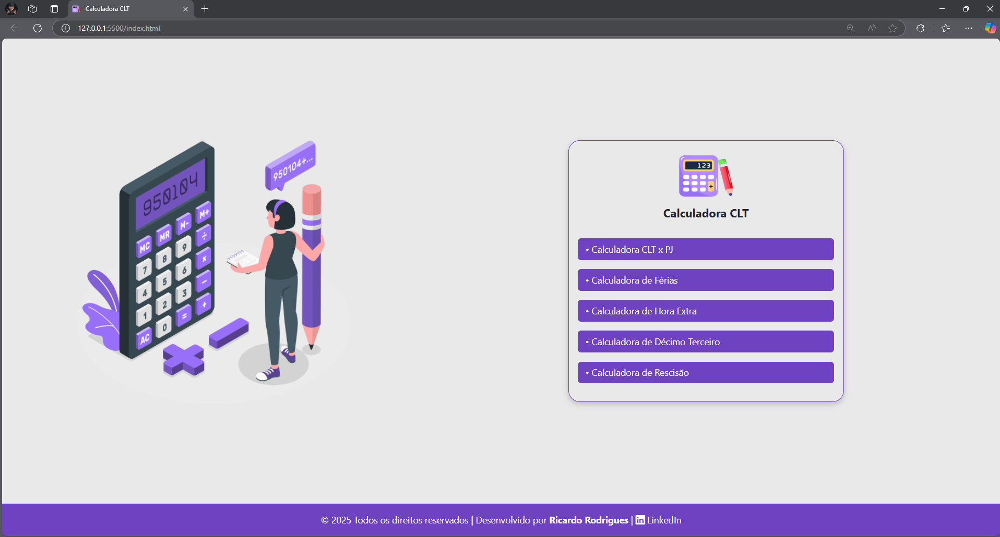
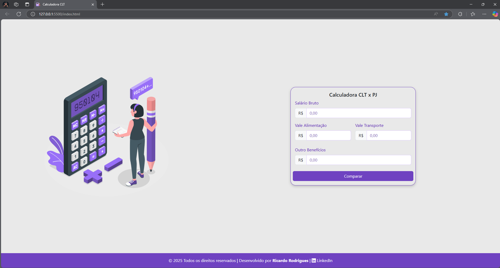
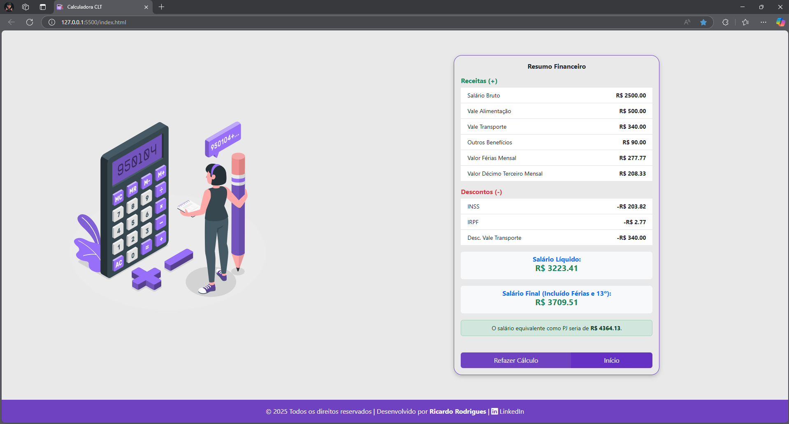
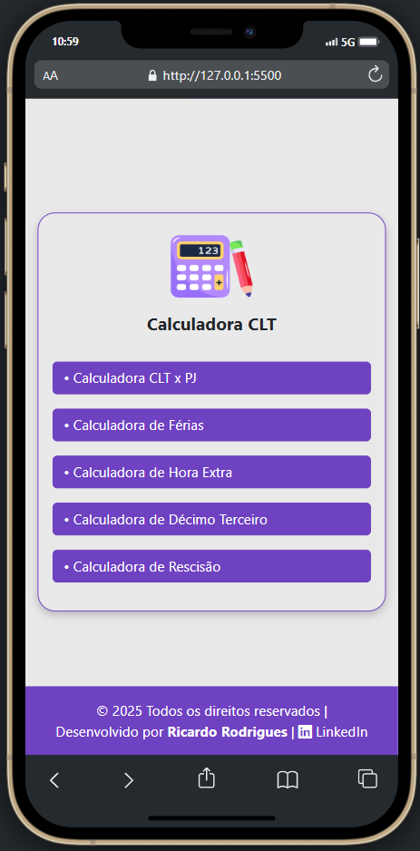

<h1 align="center">🧮 Calculadora CLT</h1>

Uma aplicação web completa para simular cálculos trabalhistas com base na CLT brasileira.

---

## 💡 Sobre o Projeto

A **Calculadora CLT** foi desenvolvida com o objetivo de facilitar a vida do trabalhador brasileiro, oferecendo uma ferramenta online gratuita para realizar cálculos de salários, férias, décimo terceiro, hora extra, rescisão e comparação entre regimes CLT x PJ.

Projetada com foco em usabilidade e clareza, a aplicação proporciona uma experiência fluida, com feedback visual e resultados detalhados para cada tipo de simulação.

🔗 <a href="https://calculadoraclt.vercel.app/" target="_blank" rel="noopener noreferrer">Clique aqui para acessar a Calculadora CLT</a>

---

## ✅ Funcionalidades

- 🧾 Comparação CLT x PJ  
- 🏖️ Cálculo de Férias  
- 🕒 Cálculo de Hora Extra (50% e 100%)  
- 🎄 Cálculo do Décimo Terceiro  
- 📉 Cálculo de Rescisão (em breve)  
- 📱 Interface totalmente responsiva  
- 💡 Feedback visual intuitivo  
- 💼 Layout simples, direto e eficiente

---

## 🔢 Como Funciona

Cada módulo da aplicação segue as diretrizes das leis trabalhistas brasileiras. Veja alguns exemplos:

- **CLT x PJ**: Considera salário bruto, benefícios (VA/VT/etc), descontos de INSS e IRRF e compara com o salário PJ equivalente.
- **Hora Extra**: Calcula adicionais de 50% e 100% com base no salário informado e nas horas inseridas.
- **Férias / 13º**: Realiza cálculos proporcionais considerando o número de meses trabalhados.
- **Rescisão**: Simula valores como aviso prévio, FGTS, férias vencidas, multas e descontos de impostos (em construção).

Todos os resultados são exibidos separando **receitas**, **descontos** e o **total líquido**, facilitando a leitura.

---

## 🧰 Tecnologias Utilizadas

<ul>
  <li>HTML5</li>
  <li>CSS3</li>
  <li>JavaScript (puro)</li>
  <li><a href="https://getbootstrap.com" target="_blank" rel="noopener noreferrer">Bootstrap 5</a></li>
  <li><a href="https://jquery.com" target="_blank" rel="noopener noreferrer">jQuery</a></li>
  <li><a href="https://igorescobar.github.io/jQuery-Mask-Plugin/" target="_blank" rel="noopener noreferrer">jQuery Mask & MaskMoney</a></li>
  <li><a href="https://icons.getbootstrap.com" target="_blank" rel="noopener noreferrer">Bootstrap Icons</a></li>
</ul>

---

## 📚 O que eu aprendi com esse projeto

Esse projeto foi uma excelente oportunidade para desenvolver e consolidar várias habilidades:

- Entendimento prático das regras da CLT e cálculos trabalhistas
- Implementação de responsividade com Bootstrap 5
- Manipulação de DOM usando JavaScript puro e jQuery
- Modularização de código JavaScript por funcionalidade
- Criação de uma interface limpa, acessível e intuitiva
- Testes manuais e validações para múltiplos cenários
- Melhoria da organização e clareza no código

---

## 🖼️ Imagens do Projeto

### 📌 Página Inicial

### 📌 Comparação CLT x PJ

### 📌 Resultado CLT x PJ

### 📱 Versão Responsiva (Mobile)

---

## 📬 Feedback e Sugestões

**Obrigado por visitar este projeto!**  
Estou totalmente aberto a sugestões — seja para melhorias, alterações no layout, ajustes de lógica ou até para relatar bugs.  
Sinta-se à vontade para abrir uma *issue* aqui no repositório ou me procurar nas redes sociais.  
Seu feedback é muito bem-vindo! 🙌

---

<<<<<<< HEAD
Desenvolvido com 💜 por **Ricardo Rodrigues**  
<a href="https://www.linkedin.com/in/ricardo-rodrigues0/" target="_blank" rel="noopener noreferrer">LinkedIn</a>
=======
## 📄 Licença

Este projeto está licenciado sob a licença **MIT**.  
Você pode usá-lo, modificá-lo e distribuí-lo conforme desejar.

---

Desenvolvido com 💜 por **Ricardo Rodrigues**  
<a href="https://www.linkedin.com/in/ricardo-rodrigues0/" target="_blank" rel="noopener noreferrer">LinkedIn</a>

>>>>>>> 1e9e02b6ef18a09c34ffe359c05dd57fb5827566
